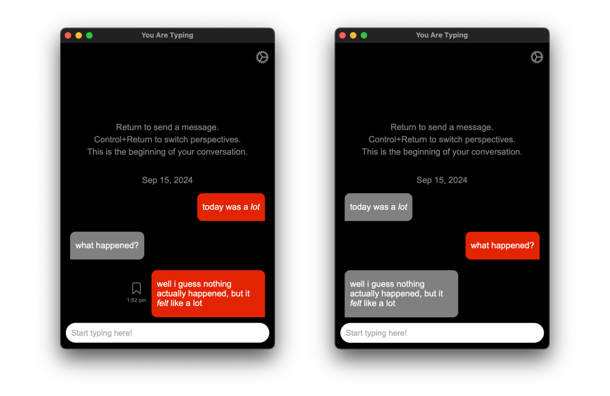
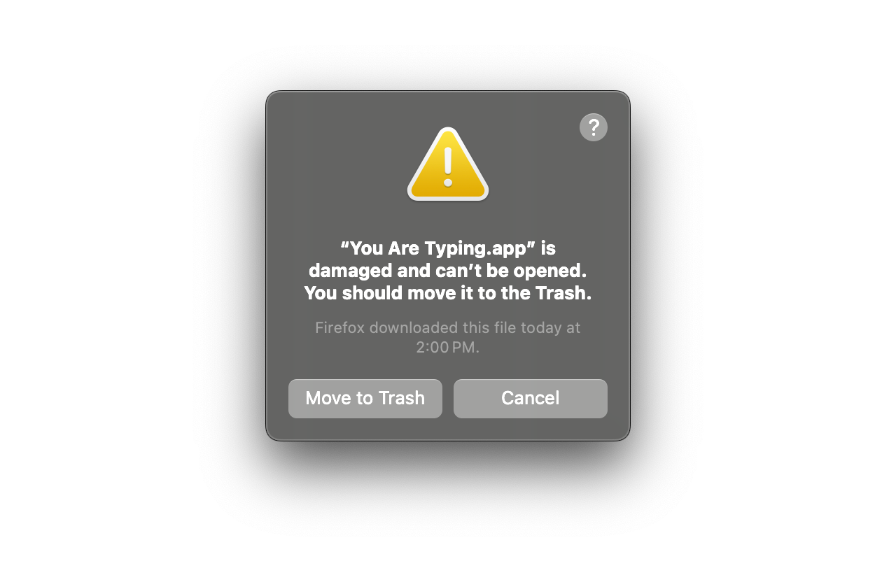

# You Are Typing


## Table of Contents

- [You Are Typing](#you-are-typing)
  - [Table of Contents](#table-of-contents)
  - [Project Status](#project-status)
  - [Description](#description)
    - [Background](#background)
    - [Features](#features)
  - [Visuals](#visuals)
  - [Installation](#installation)
    - [App is damaged error on macOS](#app-is-damaged-error-on-macos)
  - [Support](#support)
  - [Contributing](#contributing)
  - [License](#license)

## Project Status

> [!NOTE]
>
> Although I wouldn't consider this project abandoned, I also wouldn't consider
> it fully active. I only ever make updates to this program if it's something I
> *really* want to work on. Otherwise, I'm just a college student trying to keep
> up with everything.
>
> If you want to contribute your own code, it is heavily encouraged! Please read
> the [`CONTRIBUTING.md`](./CONTRIBUTING.md) file for more information.

## Description

You Are Typing allows you to have a conversation with yourself and
[become your own best friend](https://www.instagram.com/reel/C50xlZcLRhu/). It
does this by switching the perspective of the chat conversation to make it feel
like you're talking to someone else.

### Background

I created this program to help integrate myself into my support system. Sometimes
checking in with myself through a text conversation has been helpful, so maybe
it'll be helpful to you too. Check the [`proposal.md`](docs/proposal.md) file
for a more in-depth background.

### Features

- A text messaging app-like experience
- Switch perspectives with `Enter` + `Control`
- Markdown support for sent messages
- Data saved on-device, so you always have access to your messages
- Bookmark messages that are important to you
- Filter your messages by bookmarks or links
- Export your messages into a `.csv` file with `Control` + `e`
- Change the color of your messages with `Control` + `c`
- ... and more! Read the [User Guide](./docs/guide.md)!

## Visuals



By using `Enter` + `Control`, you can change the perspective of the chat and
respond to your own messages!

## Installation

You can download the latest version on the
[Releases page](https://github.com/calejvaldez/YouAreTyping/releases/latest/).

### App is damaged error on macOS



If you get this error on macOS, it's because I am not an identified developer.

After installing the app by moving it to the `Applications` folder, you must run
the following command on the Terminal:

```shell
xattr -c /Applications/'You Are Typing.app'
```

## Support

If you need any help, please open a GitHub issue and I'll try to get on it soon.

## Contributing

I don't expect people to contribute to this project, but if you're curious,
please read the [`CONTRIBUTING.md`](./CONTRIBUTING.md) file.

## License

[GNU General Public License v3.0](https://choosealicense.com/licenses/gpl-3.0/)
