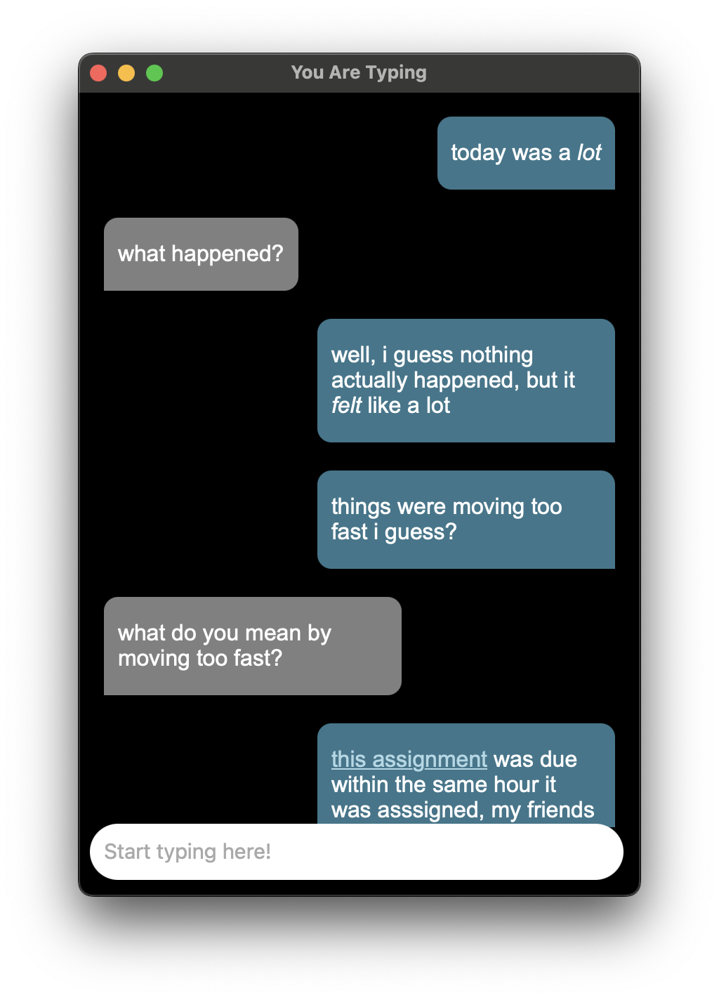
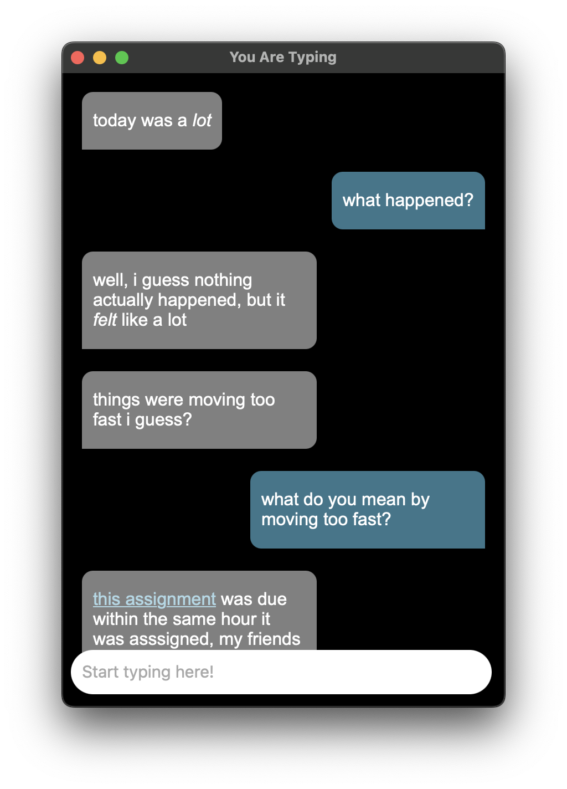

# You Are Typing


## Table of Contents

- [You Are Typing](#you-are-typing)
  - [Table of Contents](#table-of-contents)
  - [Project Status](#project-status)
  - [Description](#description)
    - [Background](#background)
    - [Features](#features)
  - [Visuals](#visuals)
  - [Installation](#installation)
    - [App is damaged error on macOS](#app-is-damaged-error-on-macos)
  - [Support](#support)
  - [Contributing](#contributing)
  - [License](#license)

## Project Status

Although I wouldn't consider this project "abandoned", I also wouldn't consider
it fully active.

## Description

You Are Typing allows you to have a conversation with yourself and
[become your own best friend](https://www.instagram.com/reel/C50xlZcLRhu/). It
does this by switching perspectives of the chat conversation to make it feel
like you're talking to someone else.

### Background

I created this program to help me get through rough moments in life. Sometimes
checking in with yourself through a text conversation has been helpful for me,
so maybe it'll be helpful to you too.

### Features

- A text messaging app-like experience
- Switch perspectives with `Enter` + `Control`
- Markdown support for sent messages
- Data saved on-device, so you always have access to your messages

## Visuals





By using `Enter` + `Control`, you can change the perspective and respond to your
own messages!

## Installation

You can download the latest version on the
[Releases page](https://github.com/calejvaldez/YouAreTyping/releases/latest/).

### App is damaged error on macOS


If you get this error on macOS, it's because I am not an identified developer
and will not spend the $100 for Apple. 💞

After installing the application with the `.dmg` file, you must run the
following command on the terminal:

```shell
xattr -c /Applications/'You Are Typing.app'
```

## Support

If you need any help, please open a GitHub issue and I'll try to get on it soon.

## Contributing

I don't expect people to contribute to this project, but if you're curious,
please read the [`CONTRIBUTING`](./CONTRIBUTING.md) document.

## License

[GNU General Public License v3.0](https://choosealicense.com/licenses/gpl-3.0/)
